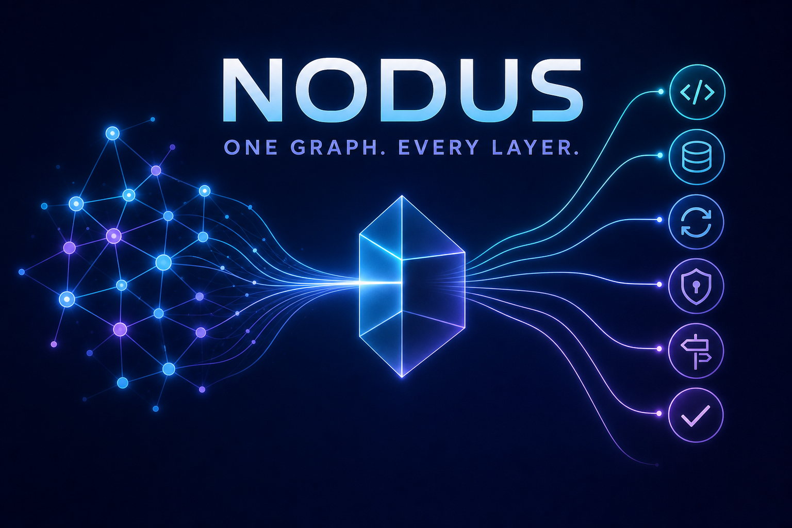
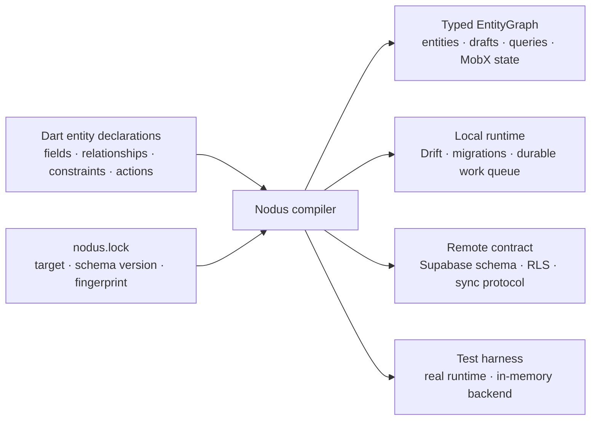
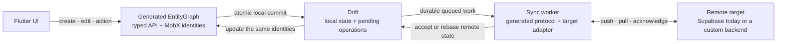

# Nodus

[](https://github.com/sidux/nodus/actions/workflows/ci.yml)
[](https://github.com/sidux/nodus/blob/main/LICENSE)
[](https://flutter.dev)



**One domain model. A complete local-first Flutter system.**

Flutter made it possible to share one interface across platforms. Nodus takes
the same idea beneath the widget tree: declare the product model once, then
compile it into reactive entities, local storage, offline mutations, durable
synchronization, backend schema and security, typed queries, and real test
infrastructure.

Instead of rebuilding the same feature as a model, store, table, repository,
DTO, serializer, sync service, database policy, and mock, you write the domain
meaning. Nodus generates the mechanics and keeps every layer aligned.

This is not an ORM with extra code generation. An ORM begins at storage; a
state library begins at the UI; a sync library begins at transport. Nodus begins
with the domain and derives the typed boundaries between all three.

> **Project status:** Nodus is at `0.1.0` and is not yet published on pub.dev.
> It is ready for evaluation and new applications, but the API may change before
> `1.0.0`.

## From shared UI to shared product meaning

A Flutter codebase can share every widget and still implement the same product
rules repeatedly in state objects, SQLite tables, API payloads, validation,
synchronization code, backend policies, and test doubles. Every copy adds work;
every disagreement becomes a bug.

With Nodus, the application-facing API stays small and domain-shaped:

```dart
final task = await entityGraph.tasks.create(title: 'Ship Nodus');

final edit = task.beginEdit()..title = 'Publish Nodus';
await edit.save();
await task.complete();

final openTasks = TaskList.all(
  entityGraph,
  where: TaskFields.status.equals(TaskStatus.todo),
);
```

Ordinary lists automatically hide tombstones, archives, and inactive
relationships. Recovery code opts into the corresponding visibility enum;
feature predicates describe only product selection. Generated relationship
mutations still see inactive identities internally, so relinking reactivates
the canonical row without exposing inactive links to product reads.

That code is simultaneously the reactive UI boundary, the local-durability
boundary, and the entry point to retryable synchronization. There is no feature
repository, DTO copy, command bus, or state mirror behind it.

Nodus replaces that duplication with a compiler-owned entity graph:



Your declarations remain the public domain types. Nodus resolves their fields,
relationships, constraints, capabilities, ownership, and authority once into
an `EntityGraphDefinition`. Every downstream emitter consumes those resolved
facts instead of independently guessing what the model means.

### What changes in practice

| Ordinary Flutter architecture | With Nodus |
| --- | --- |
| A model change must be repeated across state, storage, transport, backend, and tests. | Change the entity declaration and regenerate every affected boundary. |
| Offline support is added later as cache, queue, retry, and conflict plumbing. | Every generated mutation is local-first and records durable remote intent atomically. |
| Client validation and database rules can silently diverge. | The same constraints become Dart validation, Drift checks, transport validation, and PostgreSQL checks. |
| UI state mirrors persisted records through providers, repositories, or view models. | Widgets observe the same stable entity identities that persistence and sync update. |
| Backend tables, RLS, push APIs, and client codecs evolve separately. | Supabase schema, security, protocol, and client codecs come from the same graph. |
| Tests mock architectural seams that production may wire differently. | A generated harness runs the production graph with in-memory persistence and synchronization. |

The payoff compounds with every entity and relationship: new features inherit
the same durability, observation, authorization, query, synchronization, and
testing model without rebuilding the architecture around them. Nodus moves
Flutter development up a level—from sharing UI code to sharing product meaning.

## Quick start

### 1. Add the package

Until the pub.dev release, depend on the Git repository:

```yaml
dependencies:
  nodus:
    git:
      url: https://github.com/sidux/nodus.git
      ref: main
```

Then run `flutter pub get`.

### 2. Declare an entity

Place each entity in a `domain/` directory under `lib/`:

```dart
import 'package:nodus/nodus.dart';

final class Account {}

enum TaskStatus { todo, done }

@Entity()
abstract class Task
    implements OwnedBy<Task, Account>, Archivable, SoftDeletable {
  @Persisted(minLength: 1, maxLength: 160)
  abstract final String title;

  @Persisted(defaultValue: TaskStatus.todo)
  abstract final TaskStatus status;

  @Persisted(maxLength: 1000)
  abstract final String? description;

  bool get isCompleted => status == TaskStatus.done;

  @Action(values: [ActionValue(#status, TaskStatus.done)])
  Future<void> complete();
}
```

Fields and annotations express persisted intent. Getters and pure business
logic remain ordinary handwritten Dart on the same generated, observable
`Task` identity.

### 3. Initialize and generate

From the application root, choose the default remote target:

```sh
dart run nodus init --target supabase
```

Nodus discovers the entities, creates the reviewed `nodus.lock`, configures
generation, and emits the public `lib/nodus.g.dart` facade.

### 4. Use the generated graph

For a local development session:

```dart
import 'package:my_app/nodus.g.dart';

final entityGraph = await MyAppEntityGraph.openInMemory(
  accountId: LocalId<Account>('00000000-0000-0000-0000-000000000001'),
  autoSync: false,
);

final task = await entityGraph.tasks.create(title: 'Ship Nodus');

final draft = task.beginEdit()..title = 'Publish Nodus';
await draft.save();
await task.complete();

final openTasks = TaskList.all(
  entityGraph,
  where: TaskFields.status.equals(TaskStatus.todo),
);
```

`create`, `draft.save()`, and actions commit local state atomically. For an
entity that synchronizes, the same transaction also records durable work for
the configured remote target; it does not block on the network.

The reference app shows the complete
[Supabase authentication and graph bootstrap](https://github.com/sidux/nodus/blob/main/example/tasks/lib/app_bootstrap.dart).

For irreducible immediate online calls, `ExternalCapabilityContract` keeps the
request and response typed while `SupabaseExternalCapabilityAdapter` owns the
shared RPC or Edge Function transport and failure mapping. Domain-specific
clients and gateways retain fallback and product policy; the adapter never
becomes entity persistence, a cache, a retry queue, or a workflow registry.

## What Nodus generates

| Boundary | Generated result |
| --- | --- |
| Domain API | Stable typed entities, nominal IDs, sets, drafts, actions, relationships, and lifecycle operations |
| Reactive state | Precise MobX observation on the same entity identities used by domain code |
| Local data | Drift tables, constraints, indexes, migrations, paging, and durable operation state |
| Synchronization | Typed codecs, target routing, retry, idempotency, cursors, conflict rebase, and recovery |
| Supabase | PostgreSQL schema, native columns, checks, indexes, grants, RLS, push functions, and pull history |
| Queries | Typed fields, predicates, ordering, lookups, inverse relationships, and bounded or keyset-paged lists |
| Workflow membership | Conventional invite, reuse, accept, decline, revoke, participant access, and self-membership validation from one capability |
| Navigation (optional) | Typed GoRouter locations generated from route definition files |
| Testing | An in-memory graph harness backed by the production descriptors and runtime |

Generated files are reviewable artifacts, but they are never edited manually.
Change the declaration, then regenerate.

The important result is not simply “more generated code.” A field, constraint,
relationship, or authority change has one source and one explanation trail. The
compiler either carries it consistently through every boundary or fails with an
actionable diagnostic before the application ships.

## Local-first by construction

Local-first behavior is not a cache bolted on after the application is built.
It is the generated mutation contract. Drift is the durable local source of
truth, Flutter reads stable identities immediately, and synchronization is
retryable background work against a named remote target.



Nodus gives each non-local entity one explicit synchronization mode:

| Mode | Meaning |
| --- | --- |
| `localOnly` | State remains on the device and creates no remote work. |
| `replicated` | Local mutations are pushed and remote changes are pulled. |
| `imported` | The remote system is authoritative; local mutation is rejected. |
| `exported` | Local state is authoritative and is delivered outward. |

Supabase is the only production-ready remote target bundled in `0.1.0`. The
runtime contract is transport-neutral: a custom connector adapts Nodus's typed
push/pull protocol to another remote system. It does not choose entities or
redefine their schema. Other backend adapters are not bundled yet.

## Core capabilities

These are one coherent generated system rather than independent libraries the
application must reconcile:

- Stable entity identities with field-level observation and optimistic updates.
- Typed creation and edit drafts with validation, rollback, and field-level
  conflict detection.
- Generated relationships, unique lookups, collaboration, activity history,
  archiving, soft deletion, and scoped ordering.
- Present-entity loaders, typed heterogeneous future records, multi-query
  lease composition, and async generated-draft lifecycle hooks.
- Aggregate-boundary inference from unique bounded links and exact child-set
  replacement without handwritten reconciliation loops.
- Bounded in-memory collections and unbounded keyset-paged Drift queries behind
  typed list APIs.
- Durable account-scoped synchronization with retry, idempotency, cursors,
  wake-up signals, conflict rebase, and restart recovery.
- Deterministic generation with explanation output, schema fingerprints, and
  stale-output checks.

See the [capability reference](https://github.com/sidux/nodus/blob/main/doc/capabilities.md)
for declarations, generated APIs, synchronization semantics, routing, and
custom connector contracts.

## Reference app

The Tasks app demonstrates offline creation and editing, scoped ordering,
actions, collaboration, generated activity, tombstones, paging, adaptive UI,
typed deep links, and the durable sync queue.

```sh
cd example/tasks
flutter pub get
flutter run --dart-define=ALLOW_IN_MEMORY_DEMO=true
```

The explicit demo mode uses the generated production APIs with an in-memory
backend, so no Supabase credentials are required. See the
[reference app guide](https://github.com/sidux/nodus/blob/main/example/tasks/README.md)
for its architecture and verification steps.

## CLI

| Command | Purpose |
| --- | --- |
| `dart run nodus init --target NAME` | Discover the package and create its graph configuration |
| `dart run nodus generate` | Regenerate Dart artifacts without changing the schema version |
| `dart run nodus watch` | Regenerate when domain or route sources change |
| `dart run nodus migrate NAME` | Advance the schema and generate local and remote migrations |
| `dart run nodus explain [ENTITY] [--json]` | Show what Nodus inferred and why |
| `dart run nodus inventory [--write\|--check\|--json]` | Classify semantic migration debt |
| `dart run nodus check` | Fail on stale generated output, schema lock, or opted-in inventory |

## Documentation

- [Capabilities](https://github.com/sidux/nodus/blob/main/doc/capabilities.md) — practical declarations and generated APIs.
- [Writing custom application code](https://github.com/sidux/nodus/blob/main/doc/custom-code.md) — where irreducible business and integration code belongs.
- [Architecture](https://github.com/sidux/nodus/blob/main/doc/Architecture.md) — the normative architecture contract.
- [Architecture atlas](https://github.com/sidux/nodus/blob/main/doc/Architecture.puml) — detailed compiler, runtime, synchronization, and dependency views.
- [Contributing](https://github.com/sidux/nodus/blob/main/CONTRIBUTING.md) — development workflow and quality gates.
- [Security](https://github.com/sidux/nodus/blob/main/SECURITY.md) — supported reporting process.

## Acknowledgements

Nodus was developed with assistance from OpenAI Codex. Product and architecture
decisions remain human-owned; the scope and evidence for the collaboration are
documented in [AI-assisted development](https://github.com/sidux/nodus/blob/main/doc/ai-assisted-development.md).

## License

Nodus is available under the
[BSD 3-Clause License](https://github.com/sidux/nodus/blob/main/LICENSE).
