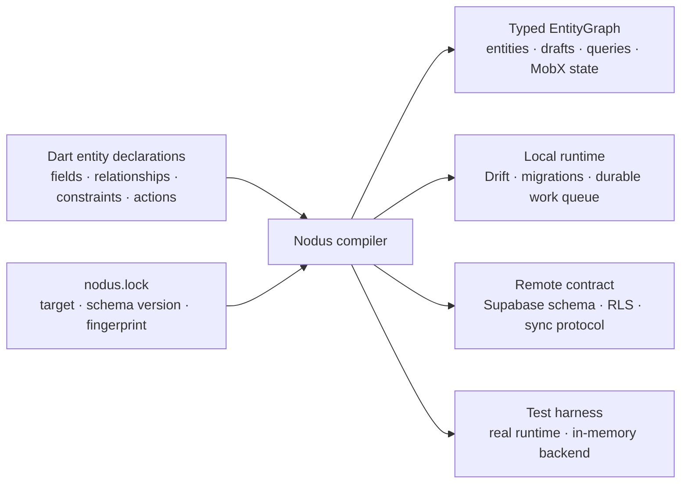
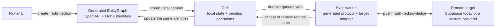

# Nodus

[](https://github.com/sidux/nodus/actions/workflows/ci.yml)
[](https://github.com/sidux/nodus/blob/main/LICENSE)
[](https://flutter.dev)


**A local-first application compiler for Flutter.**

Nodus turns typed Dart entity declarations into the infrastructure that usually
has to be repeated by hand: observable domain objects, local persistence,
queries, migrations, durable synchronization, backend schema and security, and
production-backed test utilities.

The goal is simple: describe the product model once, keep it usable as ordinary
Dart, and generate the mechanical layers from the same resolved meaning.

> **Project status:** Nodus is at `0.1.0` and is not yet published on pub.dev.
> It is ready for evaluation and new applications, but the API may change before
> `1.0.0`.

## Why Nodus

A Flutter application can share its UI across platforms while still duplicating
the same model in many places: state objects, SQLite tables, API payloads,
validation, synchronization code, backend policies, and test doubles. Those
copies inevitably drift.

Nodus replaces that duplication with a compiler-owned entity graph:



Your entity declarations remain the public domain types. Nodus resolves them
once into an `EntityGraphDefinition`; entity, storage, and synchronization
emitters consume that definition instead of independently interpreting
annotations.

## Quick start

### 1. Add the package

Until the pub.dev release, depend on the Git repository:

```yaml
dependencies:
  nodus:
    git:
      url: https://github.com/sidux/nodus.git
      ref: main
```

Then run `flutter pub get`.

### 2. Declare an entity

Place each entity in a `domain/` directory under `lib/`:

```dart
import 'package:nodus/nodus.dart';

final class Account {}

enum TaskStatus { todo, done }

@Entity()
abstract class Task
    implements OwnedBy<Task, Account>, Archivable, SoftDeletable {
  @Persisted(minLength: 1, maxLength: 160)
  abstract final String title;

  @Persisted(defaultValue: TaskStatus.todo)
  abstract final TaskStatus status;

  @Persisted(maxLength: 1000)
  abstract final String? description;

  bool get isCompleted => status == TaskStatus.done;

  @Action(values: [ActionValue(#status, TaskStatus.done)])
  Future<void> complete();
}
```

Fields and annotations express persisted intent. Getters and pure business
logic remain ordinary handwritten Dart on the same generated, observable
`Task` identity.

### 3. Initialize and generate

From the application root, choose the default remote target:

```sh
dart run nodus init --target supabase
```

Nodus discovers the entities, creates the reviewed `nodus.lock`, configures
generation, and emits the public `lib/nodus.g.dart` facade.

### 4. Use the generated graph

For a local development session:

```dart
import 'package:my_app/nodus.g.dart';

final entityGraph = await MyAppEntityGraph.openInMemory(
  accountId: LocalId<Account>('00000000-0000-0000-0000-000000000001'),
  autoSync: false,
);

final task = await entityGraph.tasks.create(title: 'Ship Nodus');

final draft = task.beginEdit()..title = 'Publish Nodus';
await draft.save();
await task.complete();

final openTasks = TaskList.all(
  entityGraph,
  where: TaskFields.status.equals(TaskStatus.todo),
);
```

`create`, `draft.save()`, and actions commit local state atomically. For an
entity that synchronizes, the same transaction also records durable work for
the configured remote target; it does not block on the network.

The reference app shows the complete
[Supabase authentication and graph bootstrap](https://github.com/sidux/nodus/blob/main/example/tasks/lib/app_bootstrap.dart).

## What Nodus generates

| Boundary | Generated result |
| --- | --- |
| Domain API | Stable typed entities, nominal IDs, sets, drafts, actions, relationships, and lifecycle operations |
| Reactive state | Precise MobX observation on the same entity identities used by domain code |
| Local data | Drift tables, constraints, indexes, migrations, paging, and durable operation state |
| Synchronization | Typed codecs, target routing, retry, idempotency, cursors, conflict rebase, and recovery |
| Supabase | PostgreSQL schema, native columns, checks, indexes, grants, RLS, push functions, and pull history |
| Queries | Typed fields, predicates, ordering, lookups, inverse relationships, and bounded or keyset-paged lists |
| Navigation (optional) | Typed GoRouter locations generated from route definition files |
| Testing | An in-memory graph harness backed by the production descriptors and runtime |

Generated files are reviewable artifacts, but they are never edited manually.
Change the declaration, then regenerate.

## Local-first by construction

Drift is the durable local source of truth. Flutter reads stable entity
identities immediately; synchronization is retryable background work against a
named remote target.



Nodus gives each non-local entity one explicit synchronization mode:

| Mode | Meaning |
| --- | --- |
| `localOnly` | State remains on the device and creates no remote work. |
| `replicated` | Local mutations are pushed and remote changes are pulled. |
| `imported` | The remote system is authoritative; local mutation is rejected. |
| `exported` | Local state is authoritative and is delivered outward. |

Supabase is the only production-ready remote target bundled in `0.1.0`. The
runtime contract is transport-neutral: a custom connector adapts Nodus's typed
push/pull protocol to another remote system. It does not choose entities or
redefine their schema. Other backend adapters are not bundled yet.

## Core capabilities

- Stable entity identities with field-level observation and optimistic updates.
- Typed creation and edit drafts with validation, rollback, and field-level
  conflict detection.
- Generated relationships, unique lookups, collaboration, activity history,
  archiving, soft deletion, and scoped ordering.
- Bounded in-memory collections and unbounded keyset-paged Drift queries behind
  typed list APIs.
- Durable account-scoped synchronization with retry, idempotency, cursors,
  wake-up signals, conflict rebase, and restart recovery.
- Deterministic generation with explanation output, schema fingerprints, and
  stale-output checks.

See the [capability reference](https://github.com/sidux/nodus/blob/main/doc/capabilities.md)
for declarations, generated APIs, synchronization semantics, routing, and
custom connector contracts.

## Reference app

The Tasks app demonstrates offline creation and editing, scoped ordering,
actions, collaboration, generated activity, tombstones, paging, adaptive UI,
typed deep links, and the durable sync queue.

```sh
cd example/tasks
flutter pub get
flutter run --dart-define=ALLOW_IN_MEMORY_DEMO=true
```

The explicit demo mode uses the generated production APIs with an in-memory
backend, so no Supabase credentials are required. See the
[reference app guide](https://github.com/sidux/nodus/blob/main/example/tasks/README.md)
for its architecture and verification steps.

## CLI

| Command | Purpose |
| --- | --- |
| `dart run nodus init --target NAME` | Discover the package and create its graph configuration |
| `dart run nodus generate` | Regenerate Dart artifacts without changing the schema version |
| `dart run nodus watch` | Regenerate when domain or route sources change |
| `dart run nodus migrate NAME` | Advance the schema and generate local and remote migrations |
| `dart run nodus explain [ENTITY] [--json]` | Show what Nodus inferred and why |
| `dart run nodus inventory [--write\|--check\|--json]` | Classify semantic migration debt |
| `dart run nodus check` | Fail on stale generated output, schema lock, or opted-in inventory |

## Documentation

- [Capabilities](https://github.com/sidux/nodus/blob/main/doc/capabilities.md) — practical declarations and generated APIs.
- [Writing custom application code](https://github.com/sidux/nodus/blob/main/doc/custom-code.md) — where irreducible business and integration code belongs.
- [Architecture](https://github.com/sidux/nodus/blob/main/doc/Architecture.md) — the normative architecture contract.
- [Architecture atlas](https://github.com/sidux/nodus/blob/main/doc/Architecture.puml) — detailed compiler, runtime, synchronization, and dependency views.
- [Contributing](https://github.com/sidux/nodus/blob/main/CONTRIBUTING.md) — development workflow and quality gates.
- [Security](https://github.com/sidux/nodus/blob/main/SECURITY.md) — supported reporting process.

## Acknowledgements

Nodus was developed with assistance from OpenAI Codex. Product and architecture
decisions remain human-owned; the scope and evidence for the collaboration are
documented in [AI-assisted development](https://github.com/sidux/nodus/blob/main/doc/ai-assisted-development.md).

## License

Nodus is available under the
[BSD 3-Clause License](https://github.com/sidux/nodus/blob/main/LICENSE).
