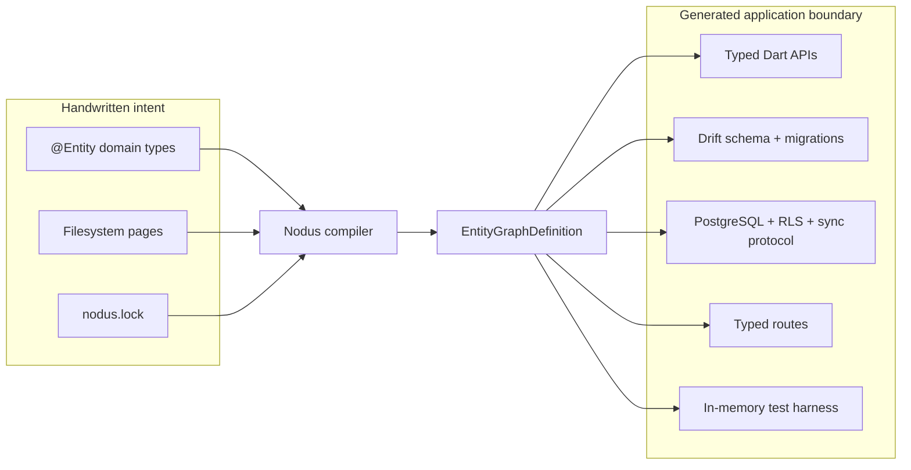
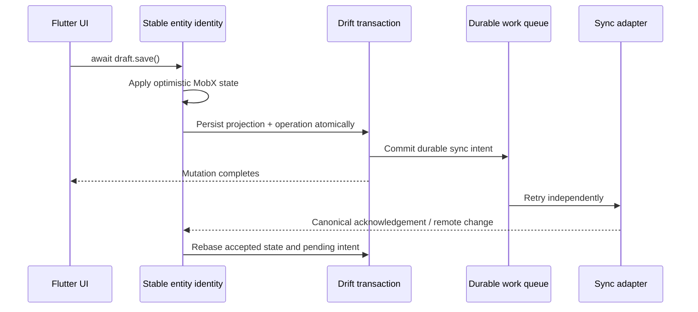

# Nodus

[](https://github.com/sidux/nodus/actions/workflows/ci.yml)
[](https://github.com/sidux/nodus/blob/main/LICENSE)
[](https://flutter.dev)


> Flutter made multiplatform UI simpler. Nodus takes the next step.

Flutter lets teams share an interface and much of their application code across
platforms. The product behind that interface is still too often restated in
reactive state, local tables, API models, synchronization logic, backend
constraints and permissions, routes, and test doubles. Those copies can drift
even when the widgets are shared.

Nodus builds on Flutter's multiplatform foundation with a local-first
application compiler. You declare one typed product model; Nodus resolves it
into a canonical graph and generates the account-scoped entities, reactive
state, mutation drafts, Drift persistence, durable synchronization, backend
schema and security, typed queries, file-based routes, and a real in-memory test
harness.

The result is more than one UI codebase: it is one product meaning carried
coherently through the application layers that must behave the same on every
platform. **Vibe coding needs rails, too.** The same typed boundary gives people
and coding agents a smaller surface to edit and deterministic infrastructure to
inspect, regenerate, and test.

Nodus is currently at `0.1.0`. It is ready for evaluation and new applications,
but its API may evolve before `1.0.0`. The package is not on pub.dev yet.

## From one multiplatform UI to one multiplatform system



The resolved `EntityGraphDefinition` is the single compiler intermediate
representation. Emitters consume resolved facts; they do not reinterpret
annotations independently. At runtime, one stable MobX identity represents an
entity while Drift owns accepted state, optimistic projection, pending
operations, conflicts, cursors, and retryable work.

That is also the AI-assisted development boundary: the agent edits concise
domain intent; the compiler expands it consistently across every layer; stale
output, invalid inference, schema drift, type errors, and behavioral regressions
fail executable gates. This does not make generated code automatically correct.
It makes more of the system derivable, reviewable, and falsifiable. See the
[evidence and claim boundaries](https://github.com/sidux/nodus/blob/main/doc/ai-assisted-development.md).

## Quick start

Add Nodus after its pub.dev release:

```sh
flutter pub add nodus
```

Until then, use the Git repository:

```yaml
dependencies:
  nodus:
    git:
      url: https://github.com/sidux/nodus.git
      ref: main
```

Declare entities below `lib/**/domain/`:

```dart
import 'package:nodus/nodus.dart';

final class Account {}

enum TaskStatus { todo, done }

@Entity()
abstract class Task
    implements OwnedBy<Task, Account>, SoftDeletable, Archivable {
  @Persisted(minLength: 1, maxLength: 160)
  abstract final String title;

  @Persisted(defaultValue: TaskStatus.todo)
  abstract final TaskStatus status;

  @Action()
  Future<void> edit({required String title});

  @Action(values: [ActionValue(#status, TaskStatus.done)])
  Future<void> complete();
}
```

Initialize the graph after the first entity declaration:

```sh
dart run nodus init --target supabase
```

Nodus discovers the package, creates the reviewed `nodus.lock`, and emits one
public `lib/nodus.g.dart` facade:

```dart
final task = await entityGraph.tasks.create(title: 'Ship Nodus');

final draft = task.beginEdit()..title.value = 'Publish Nodus';
await draft.save(); // Local state and durable sync intent are now committed.
await task.complete();

final openTasks = TaskList.all(
  entityGraph,
  where: TaskFields.status.equals(TaskStatus.todo),
);
```

## One declaration, several schemas

The `Task` declaration above is not just a Dart model. It becomes a consistent
set of typed and physical schemas:

| Boundary | Derived artifact |
| --- | --- |
| Domain | Handwritten `Task` plus generated private implementation |
| Mutation | Typed `create`, `beginEdit`, action, archive, delete, and restore APIs |
| Local data | Drift table, constraints, indexes, migration strategy, and observable identity |
| Remote data | PostgreSQL table, native scalar columns, checks, indexes, grants, and RLS |
| Protocol | Typed codecs, versioned patches, push functions, pull history, and receipts |
| Query | Typed fields, predicates, ordering, paging, named lists, and lookups |
| Test | Real in-memory database, generated descriptors, clock, IDs, and sync backend |

A simplified generated PostgreSQL shape looks like this:

```sql
create table if not exists public.tasks (
  id uuid primary key,
  owner_id uuid not null references auth.users (id) on delete cascade,
  title text not null
    check (char_length(btrim(title)) >= 1)
    check (char_length(title) <= 160),
  status text not null default 'todo'
    check (status in ('todo', 'done')),
  archived_at timestamptz,
  deleted_at timestamptz,
  server_version bigint not null default 1
);

alter table public.tasks enable row level security;

create policy tasks_select_owner
on public.tasks for select to authenticated
using ((select auth.uid()) = owner_id);
```

The real emitter additionally generates locked push functions, durable
operation receipts, ordered pull history, collaboration visibility, realtime
wake-up hints, and target-specific migration artifacts when those capabilities
are present.

## Local-first mutation semantics



Awaiting an entity mutation proves local durability and durable queue intent.
It does not wait for the network. Local-only entities create no remote work;
imported entities reject local writes; replicated and exported entities retain
retryable intent across restarts.

## Capabilities

- Stable MobX entity identities with precise field and query observation.
- Typed create/edit drafts with validation, rollback, and field-level merge.
- Bounded in-memory and unbounded keyset-paged Drift queries behind one API.
- Generated inverse relationships, unique lookups, participant access, and
  collaboration commands.
- Optional `Ordered`, `Archivable`, `SoftDeletable`, `Collaborative`,
  `ActivityTracked`, `ActivityOf`, `Component`, and `Activatable` capabilities.
- Durable push/pull scheduling, retry, idempotency, conflict rebase, cursors,
  remote signals, and account switching.
- Generated Supabase tables, indexes, RLS, grants, push functions, change log,
  and declarative migrations.
- Custom typed sync connectors for non-Supabase transports.
- Typed GoRouter locations generated from feature-owned filesystem pages.
- Generated in-memory graph harnesses using production descriptors and runtime.

The full capability reference is in
[`doc/capabilities.md`](https://github.com/sidux/nodus/blob/main/doc/capabilities.md).
The normative contract is
[`doc/Architecture.md`](https://github.com/sidux/nodus/blob/main/doc/Architecture.md),
with a companion
[`doc/Architecture.puml`](https://github.com/sidux/nodus/blob/main/doc/Architecture.puml)
atlas.

## Supabase today, other backends by contract

Supabase is the first built-in remote target because it can provision a complete
PostgreSQL schema, RLS policies, grants, push functions, change history, and
receipts. It is an implementation, not the architecture boundary.

The runtime sync contract is transport-neutral:

- entities resolve to nominal `SyncTargetId` values and typed target
  descriptors in the canonical graph;
- generated graphs accept `openWithConnectors(...)` and construct custom
  connectors from `SyncConnectorContext`;
- queues, cursors, workers, signals, operation IDs, codecs, and conflict policy
  are partitioned by target rather than by Supabase;
- adapters implement directional push/pull capabilities and translate the
  generic Nodus protocol to their transport;
- a schema-capable target may add its own provisioning emitter without changing
  entity declarations or the runtime protocol.

Adding Firebase, a REST service, SQLite-to-SQLite replication, or another
backend therefore means implementing an adapter (and, when needed, a
provisioning emitter), not forking the application architecture. Nodus already
generates and tests managed factories for inferred custom targets. Supabase is
the only production-ready remote provisioning target in `0.1.0`; the extension
contract is ready, but those additional adapters are not bundled yet.

## OpenAI Build Week

Nodus was created during OpenAI Build Week as a standalone, runnable developer
tool. It drew on pre-event experiments in Pacely's `model_first` package, but
that predecessor was not Nodus. During the event, those ideas were reworked into
the canonical graph definition, typed multi-target sync resolution, durable
drafts and actions, ordered relationship semantics, generated routes and test
harnesses, native persistence inference, the public CLI, documentation, CI, and
the executable Tasks reference app.

Codex with GPT-5.6 was used as an engineering partner to inspect the repository,
challenge architectural inconsistencies, implement bounded changes, run the
compiler and test feedback loops, and prepare this submission. It did not
replace the architecture contract:
[`doc/Architecture.md`](https://github.com/sidux/nodus/blob/main/doc/Architecture.md)
remained the authority, and every change was judged by generated output, static
analysis, and production-behavior tests. The exact baseline, change inventory,
and reproducible verification record are in
[BUILD_WEEK.md](https://github.com/sidux/nodus/blob/main/BUILD_WEEK.md).

## Run the reference app

The Tasks app exercises production Nodus behavior end to end: offline creation
and editing, project-scoped ordering, transitions, collaboration, generated
activity, tombstones, paging, adaptive UI, typed deep links, and the durable
sync queue.

```sh
cd example/tasks
flutter pub get
flutter run --dart-define=ALLOW_IN_MEMORY_DEMO=true
```

The explicit in-memory demo starts with a seeded workspace created entirely
through generated production APIs. The Sync badge intentionally exposes pending
durable work without requiring Supabase credentials.

## Tool commands

| Command | Purpose |
| --- | --- |
| `dart run nodus init --target NAME` | Create `nodus.lock`, builder configuration, and the first graph |
| `dart run nodus generate` | Regenerate application APIs quickly |
| `dart run nodus watch` | Regenerate while domain or page sources change |
| `dart run nodus explain [ENTITY] [--json]` | Explain schema, sync, capability, and field inference |
| `dart run nodus migrate NAME` | Advance the schema and generate local and remote migrations |
| `dart run nodus check` | Fail when generated output or the schema lock is stale |

## Repository layout

```text
bin/                 Nodus CLI entry point
lib/                 Public libraries and internal compiler/runtime
test/                Compiler, runtime, route, and adapter contract tests
example/tasks/       Executable Flutter reference application
doc/Architecture.md  Normative entity-first architecture contract
doc/Architecture.puml Architecture atlas
doc/ai-assisted-development.md Evidence behind the AI-assisted development claim
BUILD_WEEK.md       Event provenance, Codex workflow, and verification record
```

Generated files are reviewed artifacts but are never edited manually. A schema
change uses `dart run nodus migrate <lower_snake_case_name>` so the local schema
version, Drift history, remote schema, and migration remain one change.

## Development

```sh
flutter pub get
dart format --output=none --set-exit-if-changed .
flutter analyze
dart test --exclude-tags flutter
flutter test --tags flutter
dart doc --validate-links
dart pub publish --dry-run

cd example/tasks
dart run nodus check
flutter analyze
flutter test
```

See [CONTRIBUTING.md](https://github.com/sidux/nodus/blob/main/CONTRIBUTING.md)
before changing compiler inference,
generated APIs, synchronization semantics, migrations, or architectural
boundaries. Security reports should follow
[SECURITY.md](https://github.com/sidux/nodus/blob/main/SECURITY.md).

## License

Nodus is licensed under the
[BSD 3-Clause License](https://github.com/sidux/nodus/blob/main/LICENSE).
