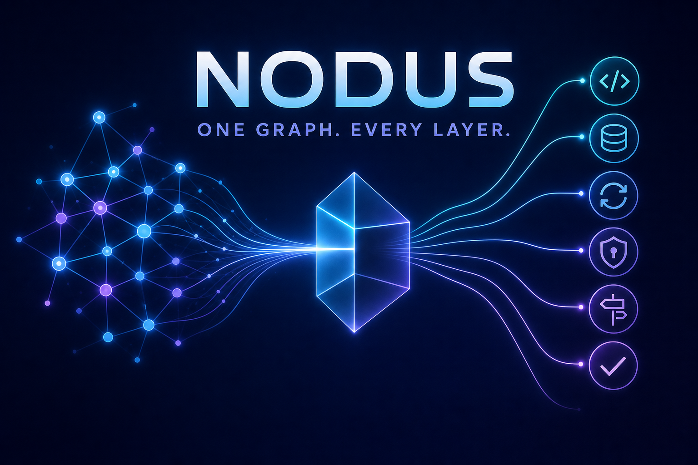

# Nodus

[](https://github.com/sidux/nodus/actions/workflows/ci.yml)
[](https://github.com/sidux/nodus/blob/main/LICENSE)
[](https://dart.dev)



**Describe your domain once. Get a complete offline-first Flutter app
underneath it.**

Nodus is a code generator for Flutter. You write annotated Dart classes that
describe your data — fields, rules, relationships, actions. Nodus turns them
into everything an offline-first app needs: reactive objects for the UI, a
local database, a durable sync queue, the backend schema and its security
rules, typed queries, typed routes, and a real test harness. Every layer stays
in agreement because every layer comes from the same declaration.

> **Status:** `0.1.0`, not yet on pub.dev. Ready for evaluation and new
> applications; the API may change before `1.0.0`. Supabase is the built-in
> backend; other backends plug in through a custom connector.

## In thirty seconds

Declare an entity:

```dart
@Entity()
abstract class Task implements OwnedBy<Task, Account>, Archivable {
  @Persisted(minLength: 1, maxLength: 160)
  abstract final String title;

  @Persisted(defaultValue: TaskStatus.todo)
  abstract final TaskStatus status;

  bool get isCompleted => status == TaskStatus.done;

  @Action(values: [ActionValue(#status, TaskStatus.done)])
  Future<void> complete();
}
```

Generate the code (`dart run nodus init --target supabase` the first time,
`dart run nodus generate` afterwards), then use it:

```dart
final task = await entityGraph.tasks.create(title: 'Ship Nodus');

final draft = task.beginEdit()..title = 'Publish Nodus';
await draft.save();
await task.complete();

final openTasks = TaskList.all(
  entityGraph,
  where: TaskFields.status.equals(TaskStatus.todo),
);
```

Each `await` saves the change to the device database together with a durable
record of what to send to the server — in one transaction — and returns
without waiting for the network. The app works offline; synchronization
retries in the background. The `task` object your widgets observe is updated
in place, whether the change came from this device or from the server.

There is no repository, DTO, serializer, sync service, state mirror, or mock to
write.

## Why Nodus

Flutter lets you share one UI across platforms. Underneath it, the same
product idea is usually still written many times: a model, a table, a
repository, a DTO, a sync queue, backend tables, security policies, validation,
and test doubles. Every copy is work, and every disagreement is a bug.

| Usual Flutter architecture | With Nodus |
| --- | --- |
| A model change is repeated across state, storage, network, backend, and tests. | Change the declaration and regenerate. |
| Offline support is added later as caches, queues, and retry logic. | Every mutation is local-first and queues its sync work atomically. |
| Client validation and database rules drift apart. | One constraint becomes Dart, SQLite, and PostgreSQL checks. |
| UI state copies records into providers or view models. | Widgets observe the same entity objects that storage and sync update. |
| Backend tables, row-level security, and client codecs evolve separately. | Schema, security, protocol, and codecs come from the same graph. |
| Tests mock layers that production wires differently. | A generated harness runs the real graph in memory. |

Nodus is not an ORM with extra steps. An ORM starts from storage, a state
library from the UI, and a sync library from the network. Nodus starts from
the domain and derives all three.

## What gets generated

| Area | Generated from your declarations |
| --- | --- |
| Domain API | Typed entities and IDs, creation, edit drafts, actions, relationships, lifecycle operations |
| Reactive state | MobX-observable entities; widgets rebuild only for the fields they read |
| Local data | Drift (SQLite) tables, constraints, indexes, migrations, paging, durable work queue |
| Synchronization | Codecs, retry, idempotency, cursors, conflict handling, restart recovery |
| Supabase backend | PostgreSQL tables, checks, indexes, grants, row-level security, push and pull functions |
| Queries | Typed fields, predicates, ordering, lookups, inverse relationships, paged lists |
| Navigation (optional) | Typed GoRouter routes from page files |
| Testing | An in-memory harness running the production graph |

When the generator cannot infer something safely, it stops with a clear
message instead of guessing. `dart run nodus explain` shows what it inferred
and why.

## Quick start

```sh
# 1. Add nodus (Git dependency until the pub.dev release) and its peers.
# 2. Declare an @Entity class under lib/**/domain/.
dart run nodus init --target supabase   # 3. One-time setup + first generation
dart run nodus watch                    # 4. Regenerate as you edit
```

```dart
import 'package:my_app/nodus.g.dart';

final entityGraph = await MyAppEntityGraph.openInMemory(
  accountId: LocalId<Account>('00000000-0000-0000-0000-000000000001'),
);
```

The [getting started guide](https://github.com/sidux/nodus/blob/main/doc/getting-started.md)
walks through dependencies, Flutter widgets, Supabase, tests, and migrations
step by step.

## Try the reference app

The Tasks app shows offline editing, ordering, collaboration, activity
history, soft deletion, paging, adaptive layouts, typed deep links, and the
sync queue. It runs without any backend credentials:

```sh
git clone https://github.com/sidux/nodus.git
cd nodus/example/tasks
flutter pub get
flutter run --dart-define=ALLOW_IN_MEMORY_DEMO=true
```

See the [Tasks guide](https://github.com/sidux/nodus/blob/main/example/tasks/README.md).

## Documentation

| Read this | To |
| --- | --- |
| [Getting started](https://github.com/sidux/nodus/blob/main/doc/getting-started.md) | Build a first entity end to end. |
| [Core concepts](https://github.com/sidux/nodus/blob/main/doc/concepts.md) | Understand the mental model and vocabulary. |
| [Capability reference](https://github.com/sidux/nodus/blob/main/doc/capabilities.md) | Look up declarations, generated APIs, sync, routing, and testing. |
| [Writing custom code](https://github.com/sidux/nodus/blob/main/doc/custom-code.md) | Decide where your own business logic and integrations go. |
| [Command line](https://github.com/sidux/nodus/blob/main/doc/cli.md) | Look up commands, options, and project files. |
| [Architecture](https://github.com/sidux/nodus/blob/main/doc/Architecture.md) | Read the complete normative contract. |
| [Contributing](https://github.com/sidux/nodus/blob/main/CONTRIBUTING.md) | Work on Nodus itself. |

All documentation is indexed in [`doc/`](https://github.com/sidux/nodus/blob/main/doc/README.md).

## Acknowledgements

Nodus was developed with assistance from OpenAI Codex. Product and architecture
decisions remain human-owned; see
[AI-assisted development](https://github.com/sidux/nodus/blob/main/doc/ai-assisted-development.md).

## License

[BSD 3-Clause](https://github.com/sidux/nodus/blob/main/LICENSE). Report
vulnerabilities privately as described in the
[security policy](https://github.com/sidux/nodus/blob/main/SECURITY.md).
