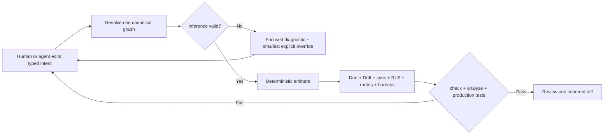

# Why Nodus fits AI-assisted development

Nodus is built around a practical thesis: **vibe coding needs rails**.

Natural-language coding tools are good at turning intent into code, but a large
application exposes the agent to duplicate representations, hidden conventions,
cross-layer drift, and feedback that arrives too late. Nodus reduces that
surface. A developer or agent changes one typed domain declaration; a compiler
resolves it once into a frozen `EntityGraphDefinition`; deterministic emitters
derive the local database, remote protocol and security, reactive entities,
queries, routes, migrations, and real test harness.

The claim is not that Nodus makes an AI infallible or guarantees faster work.
The defensible claim is narrower:

> Nodus concentrates product intent, supplies durable repository context, and
> converts many architectural mistakes into immediate compiler, schema, type,
> and behavioral-test failures.

## What the evidence says

### 1. Tests help formalize otherwise ambiguous intent

The TiCoder study starts from the problem that informal natural language is hard
to check against generated code. In a 15-programmer study, test-guided intent
clarification made participants significantly more likely to evaluate generated
code correctly and reduced reported cognitive load. Its idealized automated
experiments measured a 45.97 percentage-point average pass@1 improvement within
five interactions across the tested datasets and models.

Nodus applies the same principle at architecture scale: annotations,
capabilities, schema locks, generated descriptors, and production-behavior tests
partially formalize the prompt. This is an architectural analogy, not a measured
Nodus benchmark.

Source: [Fakhoury et al., *LLM-Based Test-Driven Interactive Code Generation*,
IEEE TSE 2024](https://arxiv.org/abs/2404.10100).

### 2. Repository context and dependency use matter

RepoExec evaluated 18 code models on repository-level generation. The authors
report that full dependency context performed best, that reduced context could
be misleading, and that models differed in whether they reused dependencies or
reimplemented them. Multi-round debugging improved correctness and dependency
use.

Nodus gives an agent a compact architectural spine: `AGENTS.md` points to one
normative contract, the graph is the single resolved source, generated APIs are
the dependency surface, and `nodus check` plus tests close the loop. Again, the
paper evaluates code models—not Nodus—so this is design evidence rather than a
causal performance claim.

Source: [Hai, Nguyen, and Bui, *On the Impacts of Contexts on Repository-Level
Code Generation*, Findings of NAACL 2025](https://aclanthology.org/2025.findings-naacl.82/).

### 3. Fast feedback is part of effective Codex use

OpenAI's Codex guidance recommends explicit goals, constraints, and definitions
of done; durable repository instructions in `AGENTS.md`; and executable checks
such as tests, linting, formatting, and type checking. Nodus makes those checks
first-class: invalid or ambiguous graph inference stops generation, stale
artifacts fail `nodus check`, Dart analysis verifies the generated surface, and
the harness exercises the production runtime against an in-memory database and
sync backend.

Source: [OpenAI, *Codex best practices*](https://learn.chatgpt.com/guides/best-practices.md).

### 4. AI speed is contextual, so architecture still matters

A randomized controlled trial by METR studied 16 experienced maintainers doing
246 real tasks in mature open-source repositories. With the early-2025 tools in
that setting, AI use increased completion time by 19%, even though developers
expected it to help. The result should not be generalized to every model,
developer, or repository; it is useful precisely because it challenges the idea
that an AI assistant alone removes software complexity.

Nodus does not claim to overturn that result. It targets several sources of
repository friction the study makes salient: scattered context, unfamiliar
cross-layer mechanics, and slow validation.

Source: [Becker et al., *Measuring the Impact of Early-2025 AI on Experienced
Open-Source Developer Productivity*](https://arxiv.org/abs/2507.09089).

### 5. Generated suggestions still require safety boundaries

An earlier empirical study generated 1,689 programs with GitHub Copilot across
89 security-relevant scenarios and found roughly 40% were vulnerable. Models and
products have advanced since that experiment, and it does not measure Nodus or
GPT-5.6. It nevertheless supports a durable engineering lesson: code generation
does not remove the need for security policy and tests.

Nodus derives Supabase RLS, grants, ownership predicates, constraint checks, and
protocol tests from the same graph as the application API. Security remains a
review responsibility, but the policy is less likely to become an unrelated
copy of domain intent.

Source: [Pearce et al., *Asleep at the Keyboard? Assessing the Security of
GitHub Copilot's Code Contributions*](https://arxiv.org/abs/2108.09293).

## The Nodus feedback loop

This loop is the product argument. Nodus moves an AI coding session away from
hand-maintaining repositories, DTOs, tables, policies, serializers, queues, and
test doubles, and toward explicit domain decisions with executable feedback.

## What still needs measurement

A post-event evaluation should compare equivalent Flutter features built with
and without Nodus and record completion time, human edits, generated diff size,
cross-layer defects, security-policy defects, and test pass rate. Until that
experiment exists, statements about Nodus improving speed or quality are a
reasoned hypothesis—not an empirical product result.
