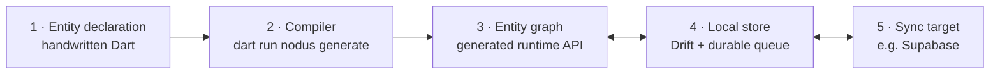
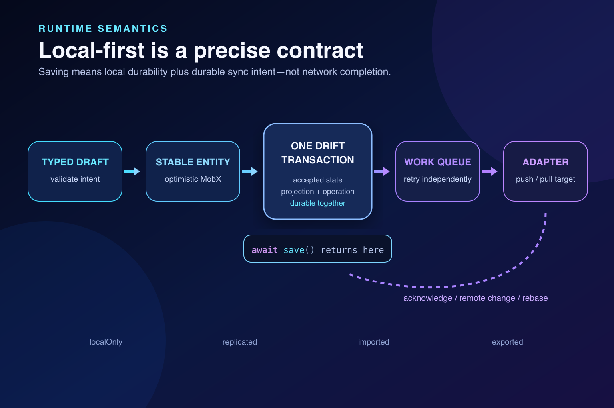
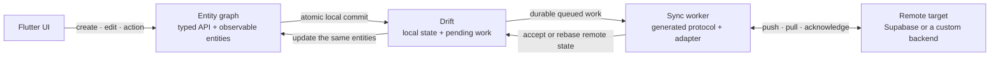

# Core concepts

This page explains the handful of ideas behind Nodus. Read it once before the
[capability reference](capabilities.md); everything else in the documentation
builds on these terms.

If you only want to see Nodus run, follow [Getting started](getting-started.md)
first and come back here.

## The problem Nodus removes

A typical offline-capable Flutter feature repeats one product idea in many
places: a model class, a local table, a repository, a DTO and serializer, a
sync queue, backend tables and security policies, validation, and test mocks.
Each copy is written and maintained by hand, and each disagreement between
copies is a bug.

Nodus keeps **one** copy: an annotated Dart class that describes the domain.
Everything else is generated from it and stays aligned automatically.

## The five building blocks



### 1. Entity declaration

An **entity** is one kind of domain object, such as `Task` or `Project`. You
declare it as an abstract Dart class annotated with `@Entity()` in a `domain/`
directory under `lib/`:

```dart
@Entity()
abstract class Task implements OwnedBy<Task, Account>, Archivable {
  @Persisted(minLength: 1, maxLength: 160)
  abstract final String title;               // persisted field + constraint

  @Persisted(defaultValue: TaskStatus.todo)
  abstract final TaskStatus status;

  bool get isDone => status == TaskStatus.done; // ordinary Dart stays yours

  @Action(values: [ActionValue(#status, TaskStatus.done)])
  Future<void> complete();                   // implementation is generated
}
```

The declaration contains only domain meaning:

- **fields** (`abstract final`) are persisted state. They have no setters:
  you change them through a draft or an action, so every change is validated
  and saved in one place;
- **annotations** (`@Persisted`, `@Reference`, ...) add constraints or intent
  that the type alone cannot express;
- **capabilities** (`Archivable`, `Ordered`, `SoftDeletable`, ...) are marker
  interfaces that switch on complete, ready-made features;
- **actions** (`@Action`) are named business transitions whose implementation
  is generated;
- **getters and pure methods** are ordinary handwritten Dart.

There is no table definition, serializer, or repository to write.

### 2. Compiler

`dart run nodus generate` reads every entity declaration, resolves what each
one means — types, defaults, relationships, ownership, indexes, sync mode — and
freezes the result into one immutable `EntityGraphDefinition`.

Every generator (Dart API, Drift tables, Supabase SQL, sync codecs, routes,
test harness) reads that single resolved definition. They cannot disagree with
each other because none of them re-interprets your source.

When the compiler cannot decide something safely, it **stops with a
diagnostic** instead of guessing, and asks for the smallest explicit
annotation. `dart run nodus explain Task` shows what was inferred and why.

### 3. Entity graph

The generated **entity graph** (for package `my_app`, the class
`MyAppEntityGraph`) is the one object your application talks to. It is opened
for one signed-in account and exposes:

- a **set** per entity for creation: `entityGraph.tasks.create(...)`;
- typed **lists** and **lookups** for reading: `TaskList.all(entityGraph)`;
- generated methods on each entity for changes: `task.complete()`,
  `task.beginEdit()`, `task.archive()`.

Each loaded entity has exactly **one stable object** in memory (the identity
map). Local edits, synchronization results, and query updates all modify that
same object, and widgets observe it directly through MobX. There is no second
copy in a provider, view model, or cache.

### 4. Local store

Every entity is stored locally in a Drift (SQLite) database owned by the graph.
This is what makes the app work offline. When you write:

```dart
await task.complete();
```

Nodus updates the in-memory entity immediately, then commits **in one local
transaction** both the new state and, for synchronized entities, a durable
"push this change" work item. When the `await` returns, the change is safe on
disk. It does **not** wait for the network.



If the commit fails, the in-memory change is rolled back and the error is
rethrown.

### 5. Sync target

A **sync target** is a remote system the graph synchronizes with. Supabase is
built in; other backends plug in through a custom connector. A background
worker pushes queued work, pulls remote changes using a durable cursor, retries
after failures, and survives app restarts.



Remote changes are written to Drift first and then update the same in-memory
entities, so the UI reacts without any manual refresh. Realtime notifications
only wake the worker up early; correctness comes from the ordered change
history and cursor, so a missed notification never loses data.

Each entity has one **sync mode**:

| Mode | Who is authoritative | Local writes |
| --- | --- | --- |
| `localOnly` | This device; nothing is synchronized | Yes |
| `replicated` | The remote target, with local changes pushed and remote changes pulled | Yes |
| `imported` | The remote system; the device only receives | No |
| `exported` | This device; changes are delivered outward | Yes |

With a default target configured (the usual case), entities are `replicated`
unless they say otherwise, for example `@Entity(sync: SyncMode.localOnly)`.

## What the compiler produces

| You write | Nodus generates |
| --- | --- |
| Entity declarations under `lib/**/domain/` | The entity graph, sets, drafts, actions, lists, lookups, and MobX-observable records |
| (nothing extra) | Drift tables, indexes, checks, and local migrations |
| (nothing extra) | Sync codecs, durable queue routing, retry, and conflict handling |
| A target such as `supabase` | PostgreSQL tables, constraints, grants, row-level security, push functions, and change history |
| Optional page files under `presentation/pages/` | Typed GoRouter routes and locations |
| (nothing extra) | An in-memory test harness that runs the real graph |

All application code imports a single generated file, `lib/nodus.g.dart`.
Implementation files live under `lib/src/generated/` and are never imported or
edited directly. To change behavior, change the declaration and regenerate.

## Schema versions and `nodus.lock`

`nodus.lock` is a small, committed, tool-owned file. It records the graph name,
the sync targets, the current schema version, and fingerprints of the
resolved physical schema (one for the device database, one overall).

- `dart run nodus generate` refuses to continue if the schema fingerprint
  changed, so a schema change can never ship without a migration.
- `dart run nodus migrate add_task_priority` records the change: it advances
  the device schema version when the local schema changed and writes the
  Drift migration and the Supabase SQL migration together for review.

You never edit `nodus.lock` or bump a version number by hand.

## Where your own code goes

Nodus generates repeatable mechanics; you still write:

- business decisions, as getters, pure methods, and declared actions on the
  entity;
- UI, observing generated entities and lists directly;
- integrations with online-only services (payments, AI, file uploads), as
  small typed clients that commit their results through generated APIs.

[Writing custom application code](custom-code.md) shows where each kind of
code belongs.

## Glossary

| Term | Meaning |
| --- | --- |
| **Entity** | An `@Entity()` abstract class describing one kind of domain object. |
| **Field** | An `abstract final` property of an entity; persisted by default. |
| **Capability** | A marker interface such as `Archivable` or `Ordered` that adds a complete generated feature. |
| **Action** | An abstract `@Action` method describing one atomic business transition. |
| **Draft** | A typed, private edit candidate (`beginEdit()` / `beginCreate()`) committed with `save()`. |
| **Entity graph** | The generated `<App>EntityGraph` runtime for one signed-in account. |
| **Set** | The per-entity creation entry point, such as `entityGraph.tasks`. |
| **List / Lookup** | Generated typed queries: zero-to-many (`TaskList`) or zero-or-one (`EntityLookup`). |
| **Identity map** | The guarantee that one entity ID maps to one live, observable object. |
| **Lease** | A scoped claim that keeps an unbounded query or entity loaded while it is in use. |
| **Bounded / unbounded** | Whether an entity's complete collection is kept in memory (`bounded`) or paged from Drift (`unbounded`, the default). |
| **Tombstone** | A soft-deleted row kept so deletion can synchronize and be restored. |
| **Sync target** | A named remote system, such as `supabase`. |
| **Sync mode** | `localOnly`, `replicated`, `imported`, or `exported`. |
| **Connector / adapter** | Code that translates Nodus's push/pull protocol for a custom remote system. |
| **`EntityGraphDefinition`** | The compiler's frozen, fully resolved description of the graph. |
| **`nodus.lock`** | Committed, tool-owned schema identity and fingerprint. |

## Next steps

- [Getting started](getting-started.md) — build a first entity end to end.
- [Capability reference](capabilities.md) — every declaration and generated API.
- [Architecture](Architecture.md) — the complete normative rules.
